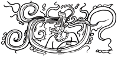

## Introduction

The aim of this project is to explore the possible uses of recent concepts like self-sovereign identity and verifiable claims in GLEIS procedures.

## Use case

The central use case studied is the filing of regulatory financial reports by a bank to the ACPR (French Prudential Supervision and Resolution Authority). For the description of the use case, we will leverage the W3C PROV [PROV] datamodel and ontology. The `prov:` prefix will be used to represent the PROV namespace.

The reporting bank is a `prov:Organization` which is supposed to have a LEI attributed by Insee (another `prov:Organization`). The reporting agent (a `prov:Person` or a `prov:SoftwareAgent`) acts on behalf of the bank and submits the report (a `prov:Entity`) to the APCR reporting system (`prov:SoftwareAgent`). The submission itself is a `prov:Activity` associated to the reporting agent in the role of the sender and the reporting system as a receiver.

## References

[PROV] https://www.w3.org/TR/prov-overview/
